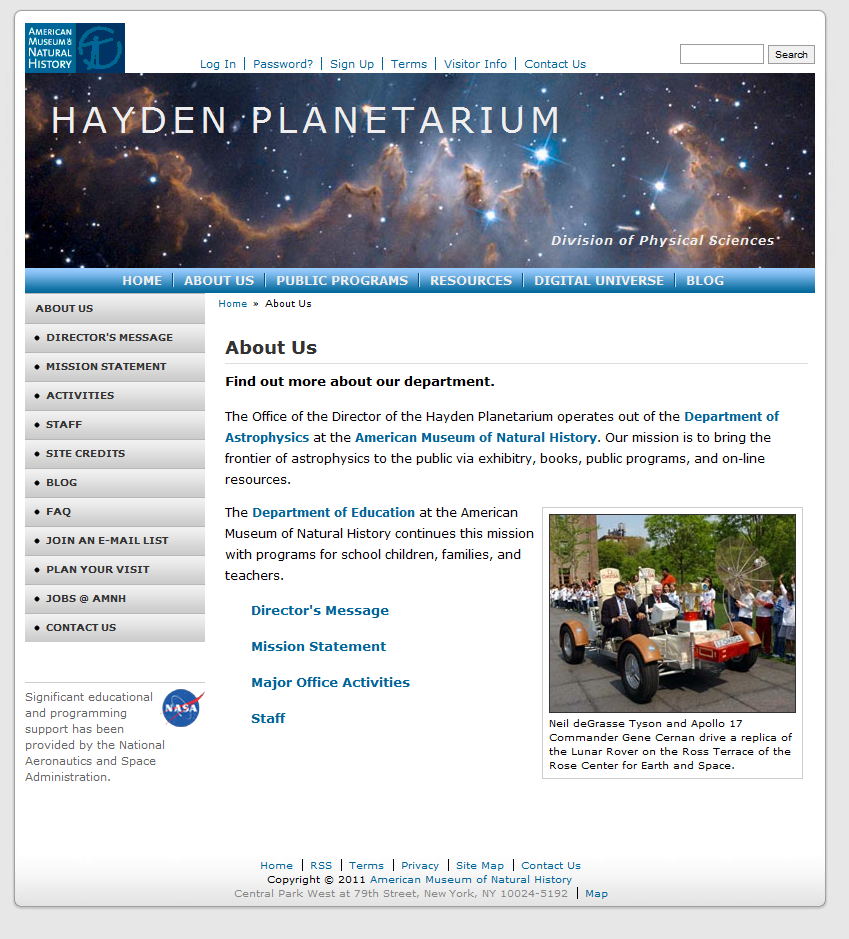

# Hayden Planetarium

> Link Demo

Develop a static HTML5 page with corresponding external CSS file.

Built with: CSS, HTML. I also use flexbox along with positioning elements to achieve the final result.

A design of Hayden Planetarium. (a png file below)

